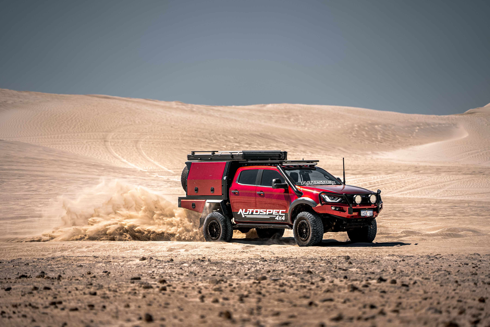

# Jordan Reeve Portfolio — Setup Notes

## Folder structure
```
portfolio/
├── index.html
├── videography.html
├── photography.html
├── about.html
├── contact.html
├── styles.css
├── script.js
├── images/     ← put your photos here
└── videos/     ← put your video files here (or use Vimeo/YouTube embeds instead)
```

## Adding your content

### Photography page
Photos are organized into subfolders by category, and the HTML already has real
`` tags pointing at specific filenames — you don't need to edit any HTML for
these, just add files with the matching name:

```
images/cars/cars-01.jpg  ... cars-06.jpg
images/travel/travel-01.jpg ... travel-06.jpg
images/construction/construction-01.jpg ... construction-06.jpg
images/sports/sports-01.jpg ... sports-06.jpg
```

Just save/export your photo with the exact matching filename (e.g. `cars-03.jpg`)
and drop it into the right folder. Once pushed, it'll appear in that slot automatically.

**Want more than 6 photos in a category?** Open `photography.html`, find a line like:
```html
<div class="card"></div>
```
Copy that whole line, paste it right after, and change `cars-06` to `cars-07` (and so on).
Then add a matching `cars-07.jpg` to the `images/cars/` folder.

**Fewer than 6 photos to start?** That's fine — until you add a matching file, that
slot just won't display an image (empty space). Add the file whenever you're ready.

### Homepage featured strip
```
images/featured/featured-01.jpg ... featured-06.jpg
```
These are the 6 highlight images near the top of the homepage.

### Other photos
```
images/profile/profile.jpg   → your photo on the About page (also reused on homepage)
```

### Videography page
Categories now include: Sports, Weddings, Corporate, Live Music, Cars, and
Trades & Construction. Videography still uses Vimeo/YouTube embeds rather than
image files — see the comment near the top of `videography.html` for the embed
snippet to paste in for each clip.

**Hero video (homepage):** in `index.html`, replace `<div class="hero-fallback"></div>` with:
```html
<video autoplay muted loop playsinline poster="images/hero-poster.jpg">
  <source src="videos/reel.mp4" type="video/mp4">
</video>
```

**Videography clips:** recommended to embed from Vimeo/YouTube rather than hosting large
video files yourself (see the comment in `videography.html`). Replace the placeholder div with:
```html
<iframe src="https://player.vimeo.com/video/YOUR_ID" style="width:100%;height:100%;border:0;" allowfullscreen></iframe>
```

## Placeholder text
Search each HTML file for text like "Placeholder" or bracketed notes — swap in your real
name, bio, contact details, and captions before publishing.

## Deploying
Drag this whole `portfolio` folder into Netlify, or push it to a GitHub repo and connect
that repo to Netlify for auto-deploys on every change.

## Contact form
The form on `contact.html` doesn't submit anywhere yet. Once the site is live on Netlify,
ask Claude to wire it up using Netlify Forms (just a couple of small attribute changes).
